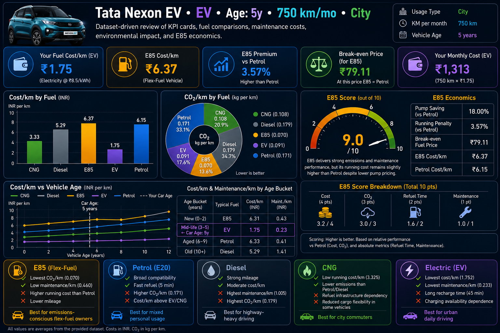

# Day 17 – Vehicle Fuel Analytics Dashboard 🚗📊

## Overview
For Day 17 of the #60DayClaudeChallenge, I analyzed a vehicle fuel dataset and built a responsive analytics dashboard to compare Petrol, Diesel, CNG, E85, and EV vehicles.

The dashboard focuses on:
- Cost per kilometer analysis
- CO₂ emissions comparison
- Maintenance cost trends
- Refueling/Recharging time analysis
- Vehicle age impact on ownership cost
- E85 economics and break-even calculations

---

## Tools Used
- Claude AI
- ChatGPT
- HTML
- CSS
- JavaScript
- SVG Charts
- VS Code
- Git & GitHub

---

## Dataset Analysis

### Metrics Calculated
1. Average Cost per km
2. Average CO₂ emissions per km
3. Average Maintenance Cost per km
4. Average Refuel/Recharge Time
5. Cost and Maintenance by Vehicle Age Bucket
6. E85 Economics
   - Pump Saving
   - Running Cost Penalty
   - Break-even Fuel Price
7. E85 Score (/10)

---

## Key Findings 🔍

### 1. E85 Paradox
E85 appeared cheaper at the fuel pump but was slightly more expensive per kilometer due to lower mileage.

### 2. EV Dominance
Electric Vehicles showed:
- Lowest running cost
- Lowest maintenance cost
- Very low emissions

### 3. Diesel Trade-off
Diesel offered good mileage but had the highest maintenance cost and emissions.

### 4. CNG Value
CNG provided low running costs while maintaining lower emissions compared to Petrol and Diesel.

### 5. Vehicle Age Matters
Operating costs generally increased as vehicles aged, especially maintenance expenses.

---

## Surprising Insight 💡

The most surprising discovery was that E85's lower fuel price did not automatically translate into lower running costs.

Although E85 saved money at the pump, the reduced fuel efficiency caused the actual cost per kilometer to become slightly higher than Petrol.

Without visualization, this insight would have been difficult to spot from raw data alone.

---

## Dashboard Features

### KPI Cards
- Cost per km
- Monthly cost estimate
- E85 premium vs Petrol
- Break-even fuel price
- Fuel comparison metrics

### Charts
- Cost per km Bar Chart
- CO₂ Doughnut Chart
- Cost vs Vehicle Age Line Chart
- E85 Score Gauge

### Fuel Comparison Cards
Each fuel type includes:
- Pros
- Cons
- Best Use Case

---

## What I Learned 🎯

### Data Analytics
- Fuel price alone is not enough for decision making.
- Cost per kilometer provides a more realistic ownership metric.
- Combining multiple metrics creates better insights.

### Data Visualization
- Visual storytelling makes hidden patterns obvious.
- Interactive dashboards improve decision-making.
- SVG charts can create lightweight, responsive analytics dashboards.

### AI-Assisted Development
- AI accelerates data exploration.
- AI helps generate dashboards faster.
- Human interpretation remains essential for meaningful insights.

---

## Screenshots

### Dashboard


### VS Code Project Structure


---

## Project Files

```text
Day17/
├── day17.md
├── fuel_dashboard.html
├── analysis_findings.md
└── screenshots/
    ├── dashboard.png
    └── vscode.png
```

---

## LinkedIn Post

Today I transformed a vehicle fuel dataset into an interactive dashboard comparing Petrol, Diesel, CNG, E85, and EV vehicles.

A surprising insight was that E85 looked cheaper at the fuel pump but became slightly more expensive per kilometer because of lower fuel efficiency.

This project reinforced the importance of analyzing total operating cost rather than focusing on fuel price alone.

Data visualization helped reveal relationships between cost, emissions, maintenance, and vehicle age that were difficult to identify from raw CSV data.

Thanks to @Anthropic @ABTalksOnAI and @AnilBajpai for encouraging continuous AI learning and experimentation.

---

## Repository

GitHub: https://github.com/ayushman6684/60-days-of-ai-challanger

#60DayClaudeChallenge #ClaudeAI #DataAnalytics #DataVisualization #DashboardDesign #GenerativeAI #AIProjects #LearningInPublic
prompt//////////////////////////////////////////////
## Details
- Vehicle : [YOUR VEHICLE MODEL]
- Fuel    : [Petrol/Diesel/CNG/E85/EV]
- Usage   : [City/Highway/Mixed/Fleet]
- KM/month: [e.g. 1000]
- Car Age : [e.g. 3 yrs]

## Role
Data analyst. Read attached CSV → compute metrics → output one HTML dashboard. HTML only, no explanation.

## Compute (group by Fuel_Type)
1. Avg Cost/km        = Fuel_Cost_INR ÷ Distance_km
2. Avg CO₂/km         = CO2_emitted_kg ÷ Distance_km
3. Avg Maintenance/km = Maintenance_Cost_INR ÷ Distance_km
4. Avg Refuel time    = Refuel_Recharge_time_min
5. Age buckets: New(0-2y) Mid-life(3-5y) Aged(6-9y) Old(10+y)
   → show Cost/km and Maint/km per bucket. Mark [CAR AGE] yrs.
6. E85 Paradox:
   - Pump saving    = ((Petrol_price−E85_price)/Petrol_price)×100
   - Running penalty= ((E85_cpkm−Petrol_cpkm)/Petrol_cpkm)×100
   - Break-even     = (E85_mileage÷Petrol_mileage)×Petrol_price
7. E85 Score/10: cost=4pt CO₂=3pt refuel=2pt maint=1pt

## Dashboard (no CDN, pure SVG charts, CSS in <style>, JS in <script>)
Dark navy #0a0f1e, glassmorphism. Colours: E85=amber Petrol=blue Diesel=grey CNG=green EV=purple.

1. Header — '[YOUR VEHICLE] · [FUEL] · Age:[CAR AGE]y · [KM/month]km/mo'
2. KPI Cards (5) — your fuel cost/km | E85 cost/km | E85 premium vs Petrol | break-even price | your monthly cost
3. SVG bar chart: Cost/km per fuel | SVG doughnut: CO₂/km per fuel (hover tooltips)
4. SVG line chart: Cost/km vs age (0-12y) per fuel. Vertical line at [CAR AGE].
5. SVG gauge: E85 score/10 (CSS animated). One verdict sentence.
6. Fuel cards: highlight [FUEL] with glow. Each: 2 pros ✅ 2 cons ❌ best-for 🚗

Output: <!DOCTYPE html> only. All numbers from CSV. Responsive 375px–1440px.