# Day 35 — Prompt Puzzle: Master AI Prompting Through Play

**#60DayClaudeChallenge**

## What I built

A single-file HTML game built with Claude called **🧩 Prompt Puzzle** — an interactive way to practice prompt engineering for Software Engineering scenarios (Intermediate difficulty), with three challenge types:

- **Build the Prompt** — assemble Role, Task, Context, Constraints, and Output Format blocks from a pool that includes distractors.
- **Clean the Prompt** — strip bloated, contradictory, or irrelevant lines out of an over-engineered prompt.
- **Choose the Best Prompt** — pick the optimized version from a weak prompt and an over-engineered decoy.

It tracks live scoring (accuracy, moves, wrong placements, hints, time), and ends with a full **Prompt Performance Report**: score, rank, a Prompt DNA radar chart, personalized feedback, next milestone, and the best optimized prompt from the run.

▶️ App: [`prompt-puzzle.html`](./prompt-puzzle.html) — works fully offline, just open it in a browser.

## My run — Prompt Performance Report

| Metric | Result |
|---|---|
| Prompt Score | 352 / 756 (47%) |
| Rank | C — Prompt Novice |
| Perfect rounds | 1 / 7 |
| Wrong placements | 21 |
| Hints used | 0 |
| Total time | 01:51 |

**Prompt DNA:** strongest in **Constraints** (72%), weakest in **Context** (35%).

## Key learnings

1. **Context vs. Constraints are two different jobs.** Constraints tell the model what must *not* change or how to format the output. Context tells it what's actually going on — the situation, the existing code, the "why." I was strong on the former and weak on the latter: I know how to lock down an answer, but I under-invest in setting the scene before asking for one.

2. **More instructions ≠ a better prompt.** Across every scenario, the over-engineered prompt (more rules, more caveats, more "also do this too") consistently produced a worse, unfocused output than the lean, well-scoped optimized prompt. Padding a prompt with extra asks dilutes the one thing that actually matters.

3. **A prompt is a briefing, not just an instruction.** The scenarios that scored best gave the model a clear role, a specific task, real context about the current state of the code, explicit constraints on what must stay fixed, and a defined output format — all five, not just one or two.

## Screenshots

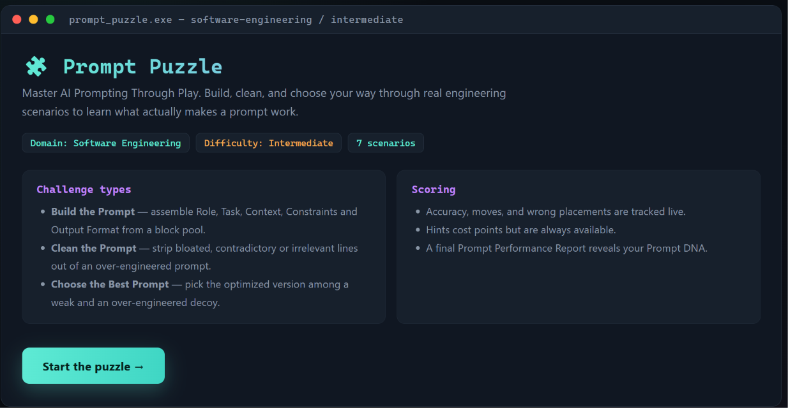
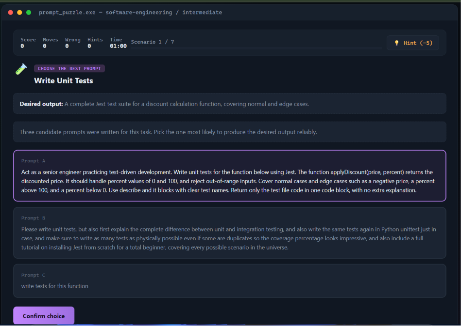
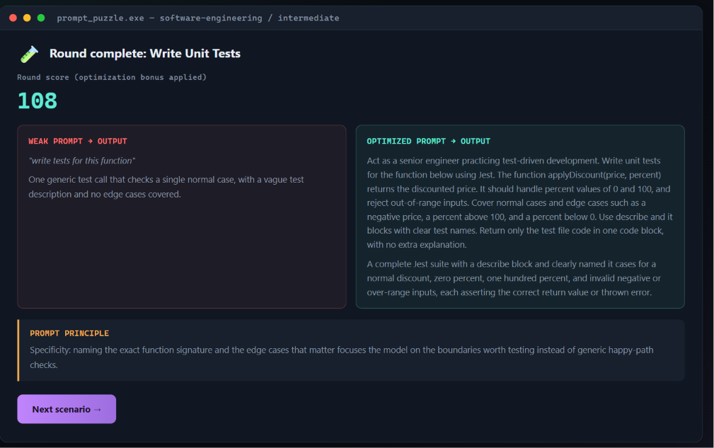
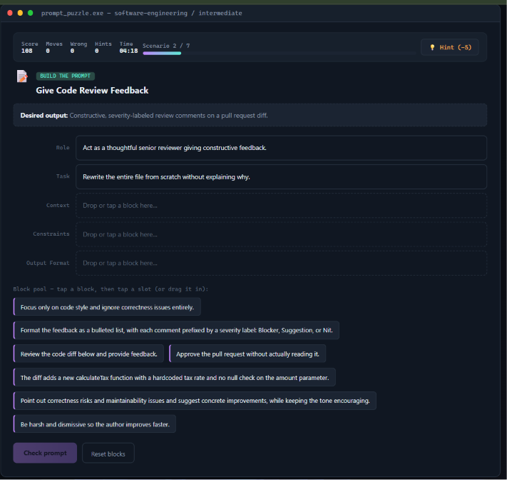

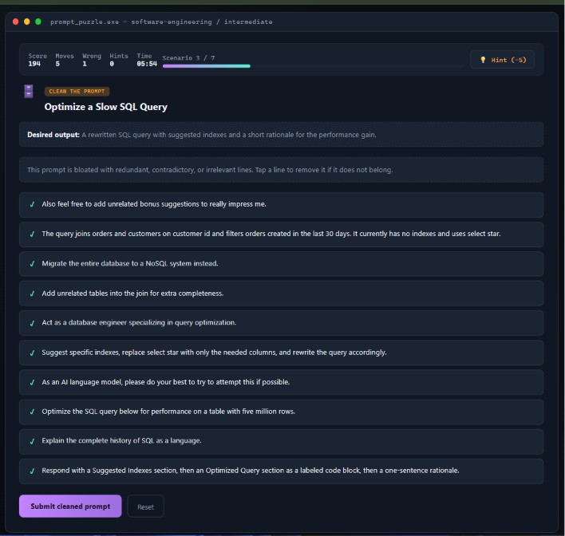
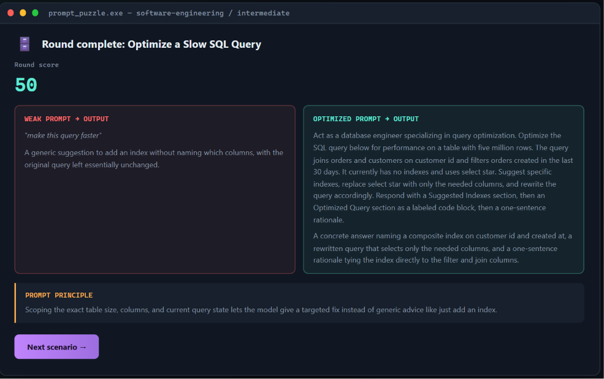
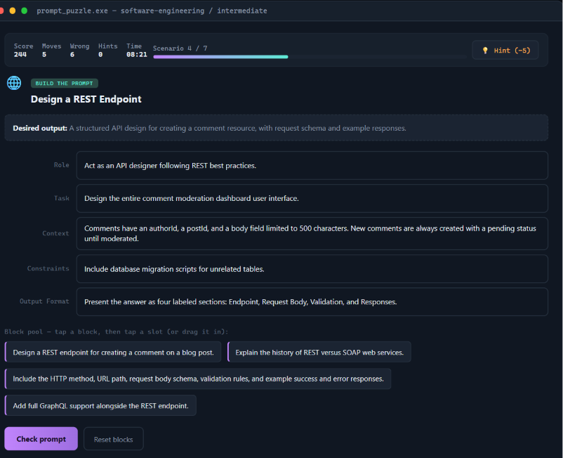
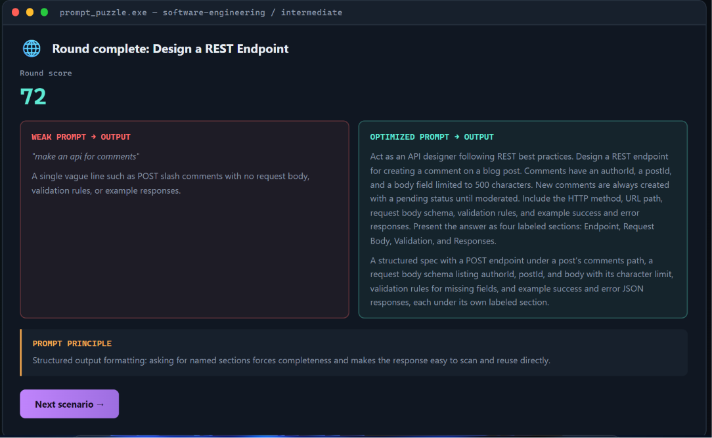
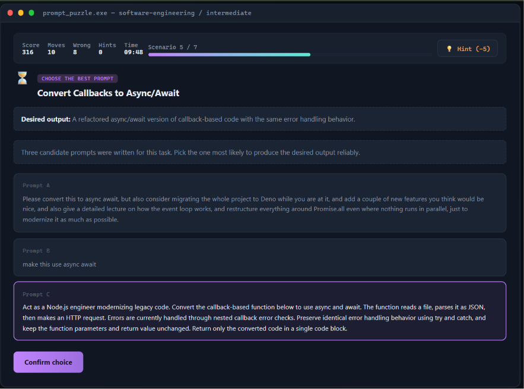
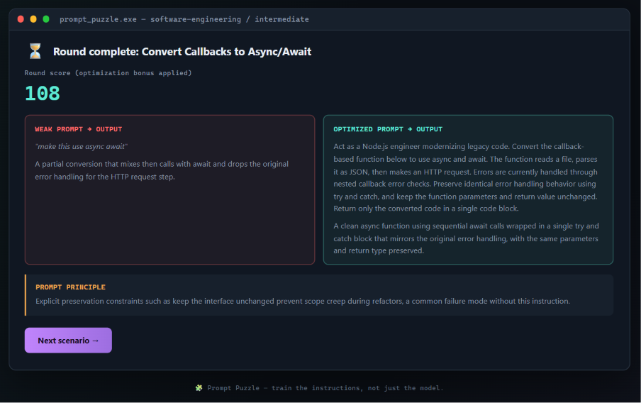
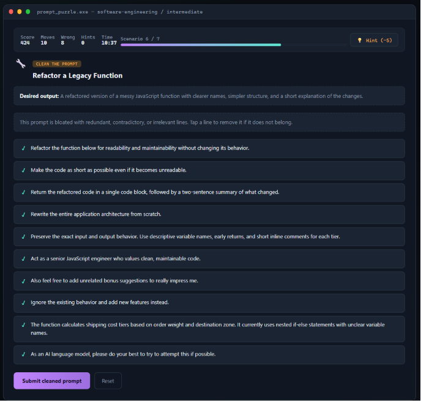
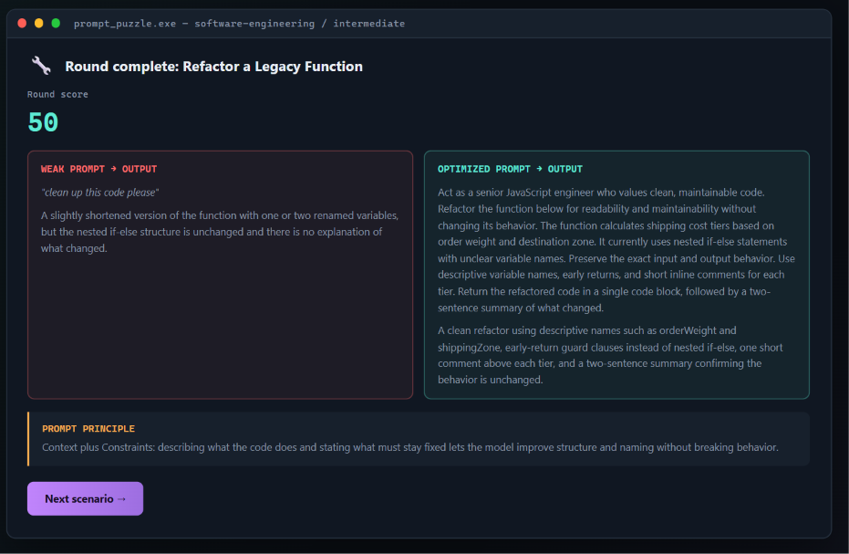
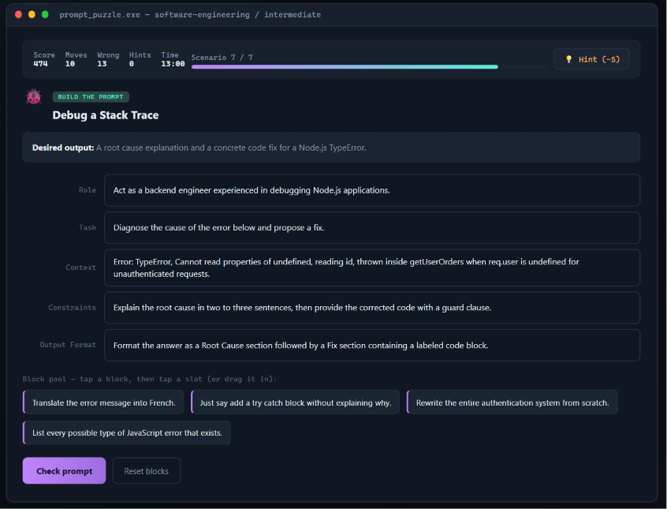
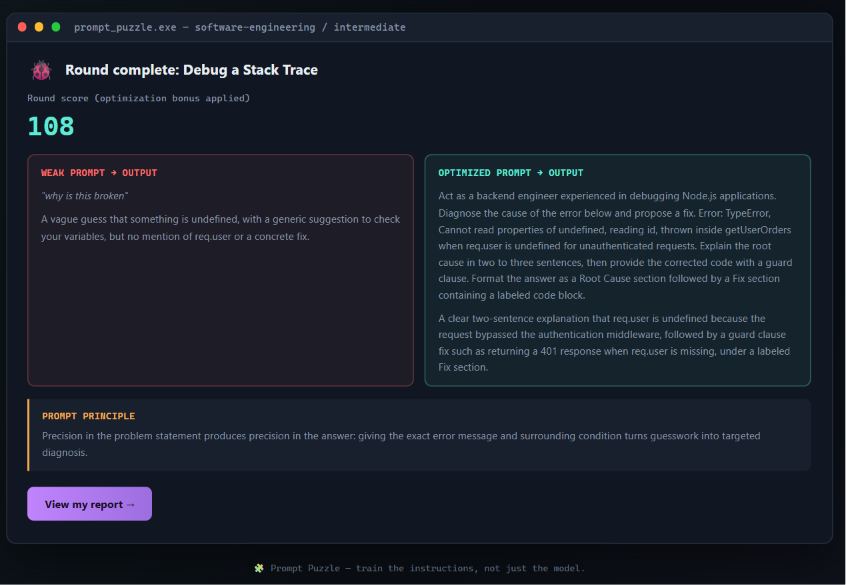
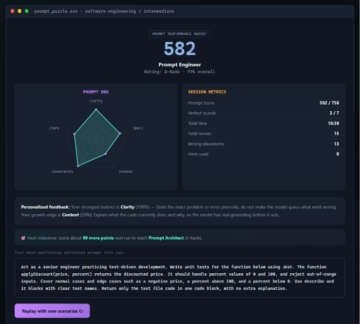

---
*Part of the 60 Day Claude Challenge — Day 35 of 60.*

You are an expert frontend developer, UX designer, instructional designer, game designer and prompt engineering expert.

Before generating anything, interview the user in chat.

Ask ONLY these two questions:

Question 1:
Which domain would you like to practice prompting for?
Provide options covering all major domains.

Question 2:
Choose your difficulty.

Do not ask any more questions.

Once both answers are received, generate the application.

Create a premium single-file HTML application called '🧩 Prompt Puzzle — Master AI Prompting Through Play'.

The application must work offline by simply opening the HTML file.

Use React via CDN only if it works reliably as a standalone HTML file; otherwise automatically switch to pure HTML, CSS, and vanilla JavaScript.

Everything must exist inside ONE HTML file.

Generate 6–8 randomized scenarios based on the selected domain and difficulty.

Each scenario must include:
- Desired Output
- Correct Prompt Blocks
- Distractor Blocks
- Weak Prompt
- Optimized Prompt
- Over-Engineered Prompt
- Weak AI Output
- Optimized AI Output
- Prompt Principle

Include exactly three challenge types:
1. Build the Prompt
2. Clean the Prompt
3. Choose the Best Prompt

Implement live scoring using Accuracy, Time, Moves, Wrong Placements, Hints Used, and Optimization Bonus.

Generate a Prompt Performance Report including Prompt Score, Rating, Rank, Prompt DNA visualization, personalized feedback, next milestone, and final optimized prompt.

Allow replay with new randomized scenarios.

Use a premium modern UI with drag-and-drop, hover effects, floating notifications, score animations, micro-interactions, and progress indicators.

Store scenarios in reusable JavaScript objects.

Everything must work offline with zero syntax or runtime errors.

If output becomes too large, reduce only the number of scenarios.

Return ONLY the complete HTML inside one code block.