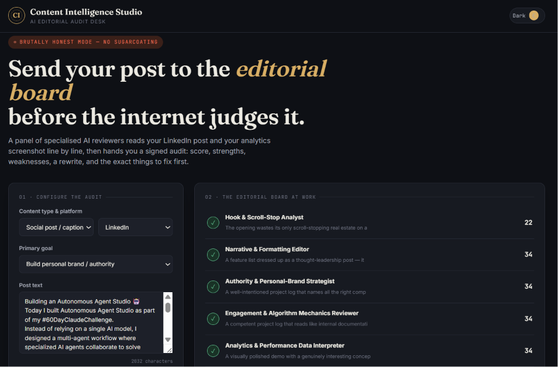
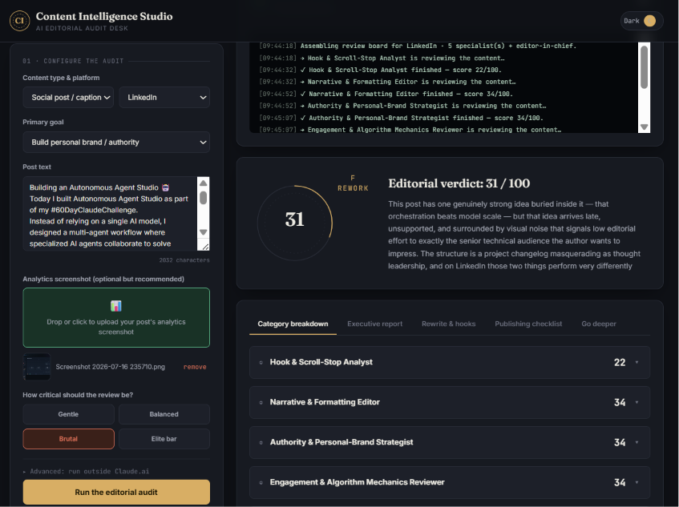

# Day 47 — Content Intelligence Studio

## What I built
An AI-powered content consultant: a single-page HTML app that runs LinkedIn (and other platform)
posts through a panel of specialized AI reviewers — hook strategist, narrative editor, authority/brand
strategist, engagement mechanics reviewer, and an analytics interpreter that reads screenshots directly —
then synthesizes everything into one editorial audit: score, strengths, weaknesses, missed opportunities,
a full rewrite, alternative hooks/titles, and a publishing checklist.

## Key learnings
- Designed a multi-stage AI review pipeline instead of a single prompt — each reviewer has a narrow,
  specialized system prompt, which produces sharper, more specific feedback than one generalist pass.
- Avoided JSON parsing entirely to prevent brittle "expected '{' or '('" errors — used a plain-text
  `###MARKER###` format instead, parsed with simple regex/string splitting.
- Learned the practical difference between running inside a proxied AI environment (no API key needed)
  vs. calling the API directly from a browser (needs a key, hits CORS otherwise) — and built a fallback
  for both.
- Added a no-API "demo mode" with realistic sample output so the interface can be previewed/shared
  without burning API calls or requiring a key.
- Practiced building a premium, distinctive UI from scratch in vanilla HTML/CSS/JS — no frameworks,
  no component libraries — including dark mode, animated score seal, live activity log, and interactive
  checklist.

## Screenshots

## Try it
Open `content-intelligence-studio.html` in a browser. Click **"Preview demo (no API key needed)"**
to see a full sample audit run end-to-end, or paste your own API key under **Advanced** to run a live analysis.

Content Intelligence Studio

You are an expert content strategist, platform growth specialist, creator coach, behavioral psychologist, prompt engineer, AI systems architect, UX designer, and senior frontend developer.

Interview first, one question at a time, using MCQs only (free text only for a final "Other" option).

What type of content would you like to analyze?
Which platform is it for?
What was your primary goal?
What would you like to upload? (text, image, screenshot, thumbnail, analytics, transcript, etc.)
How critical should the review be?

After the interview, build a polished single-page HTML application called Content Intelligence Studio that acts as an AI content consultant. The app should accept both text and image inputs and analyze them using the Claude Messages API (fetch to https://api.anthropic.com/v1/messages, no key required).

The application should automatically design an intelligent multi-stage review workflow using specialized AI reviewers appropriate for the uploaded content, each with production-quality system prompts. Every insight, score, explanation, and recommendation must come directly from Claude through live API calls. Do not use hardcoded logic, placeholder analysis, canned feedback, or rule-based scoring.

The dashboard should feel like a premium SaaS product, showing upload previews, overall content score, detailed category breakdowns, AI reasoning, strengths, weaknesses, missed opportunities, platform-specific recommendations, rewritten versions, alternative hooks and titles, publishing checklist, live activity log, reviewer status, and a comprehensive final report. If images or screenshots are uploaded, Claude must analyze the visual content directly.

End with an executive summary, content health report, highest-impact improvements, predicted performance potential (clearly presented as an AI estimate), before-vs-after comparison, and further prompts for deeper optimization.
Donot expect json format anywhere in order to avoid errors like "expected '{' or '('"

Build constraints: Single self-contained HTML file using only vanilla HTML, CSS, and JavaScript. No external libraries. Commercial-grade UI/UX, responsive design, dark mode, smooth animations, interactive visualizations, robust error handling, loading states, graceful retry logic, and zero syntax errors.