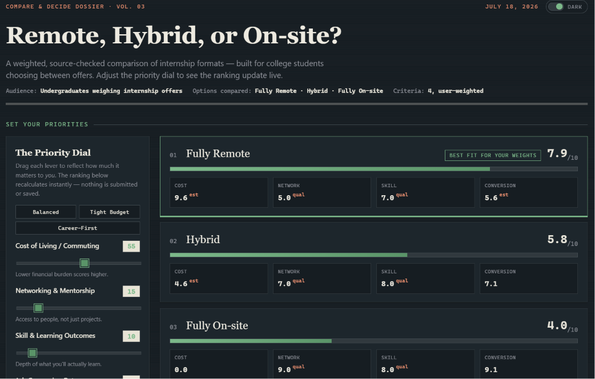
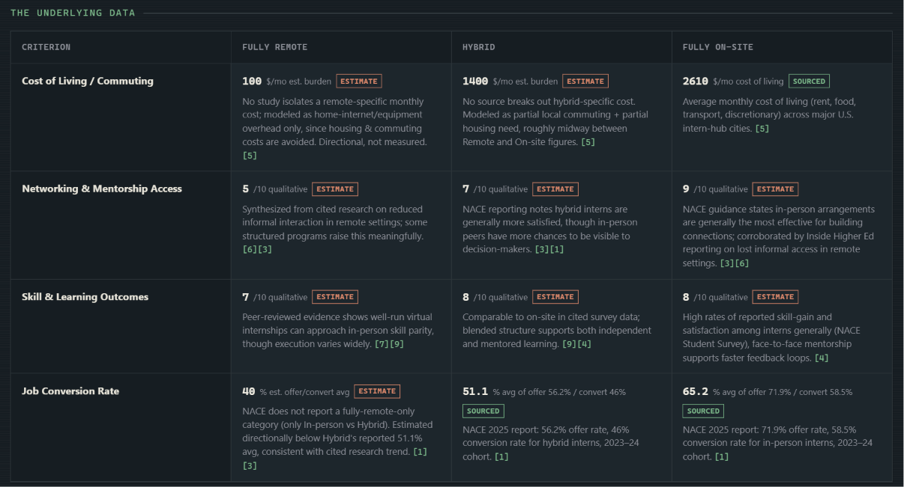

# Day 48 — Compare & Decide Builder: Remote vs Hybrid vs On-site Internships

## Objective
Build a data-driven, single-file HTML decision tool comparing Fully Remote, Hybrid,
and Fully On-site internship formats for college students choosing between offers.

## What I built
An interactive HTML/CSS/JS dossier (`internship-format-decider.html`) with:
- A "Priority Dial" — four live-adjustable weight sliders (Cost, Networking,
  Skill Outcomes, Job Conversion Rate) that instantly re-rank the three formats.
- A ranked leaderboard with per-criterion score breakdowns.
- A sourced data table — every figure tagged **Sourced** (a real reported
  statistic) or **Estimate** (a flagged, directional placeholder used only
  where no source isolates that exact number).
- A collapsible "How this was researched" panel explaining data conflicts
  between report years and how they were resolved.
- A full citations panel linking every source used.
- A light/dark theme toggle.

## Sourced data report

| Criterion | Fully Remote | Hybrid | Fully On-site | Source |
|---|---|---|---|---|
| Cost of living / commuting | ~$100/mo (estimate) | ~$1,400/mo (estimate) | $2,610/mo (sourced) | 2nd Address Research |
| Networking & mentorship | 5/10 (qualitative) | 7/10 (qualitative) | 9/10 (qualitative) | NACE Best Practices; Inside Higher Ed |
| Skill & learning outcomes | 7/10 (qualitative) | 8/10 (qualitative) | 8/10 (qualitative) | ScienceDirect; Springer/Discover Education |
| Job offer rate | ~40% (estimate) | 56.2% (sourced) | 71.9% (sourced) | NACE 2025 Internship & Co-op Report |
| Job conversion rate | — (no isolated figure) | 46% (sourced) | 58.5% (sourced) | NACE 2025 Internship & Co-op Report |

Full source list (9 citations) is in the app's "Sources cited" panel, including:
NACE (multiple reports), 2nd Address Research, Inside Higher Ed, ScienceDirect,
Extern, and Discover Education (Springer Nature).

## Key learnings
1. **Not every criterion has a clean number.** Job conversion rate has solid
   NACE data for In-person vs Hybrid, but NACE never isolates "fully remote" —
   so that figure had to be clearly flagged as an estimate rather than invented
   as if it were measured.
2. **Report-year conflicts are normal, not contradictions.** NACE's 2024, 2025,
   and 2026 reports show different topline conversion numbers because they
   track different intern cohorts — the fix was picking the one report (2025)
   that actually breaks results out by format, since that's what the comparison
   needed.
3. **Qualitative synthesis needs its own visual language.** Networking and
   skill-outcome scores are informed judgment calls from descriptive research,
   not survey numbers — labeling them distinctly from hard statistics kept the
   tool honest instead of implying false precision.
4. **Layout bugs hide in "combined" cells.** Stacking all three options' notes
   into one shared table column created huge dead whitespace above shorter
   cells; moving each note under its own figure (same column) fixed both the
   visual gap and the readability.

## Screenshots

Compare & Decide Builder

You are an expert research analyst, data journalist, UX designer, and frontend developer.

Before generating anything, interview the user ONE QUESTION AT A TIME in quiz form (MCQs only).

1. What are you trying to decide between? (Ask for the general category, then present four realistic examples of comparable options in that category.)
2. Who is this tool for, and what's the one decision they need to walk away confident about?
3. What criteria matter in this comparison? (Ask for at least four measurable criteria, e.g. cost, time, risk, quality, availability.)
4. Where should the underlying data come from? (Ask the user to name at least two real, citable sources per criterion, or confirm you should research and cite real sources yourself.)
5. Should the user be able to weight criteria by personal priority, or see one fixed ranking?

After collecting the answers:

1. Research and verify real data points for each option against each criterion, using only sources you can name and cite. Do not invent numbers, benchmarks, or scores.

2. Build a premium single-file HTML application (HTML/CSS/JavaScript only, no external libraries) that lets the user adjust criteria weights and see a ranked result update live.

The application should:
- Display a visible sources panel listing every citation used.
- Flag clearly if any data point is an estimate or a synthetic placeholder rather than sourced fact.
- Handle loading states, empty states, and edge cases gracefully.
- Be fully responsive with clean, professional visual design.

3. Add a collapsible "How this was researched" panel explaining where each data point came from and any conflicts between sources you had to resolve.

Generate the complete application only after all interview questions have been answered.

Return ONLY the complete HTML inside one code block.