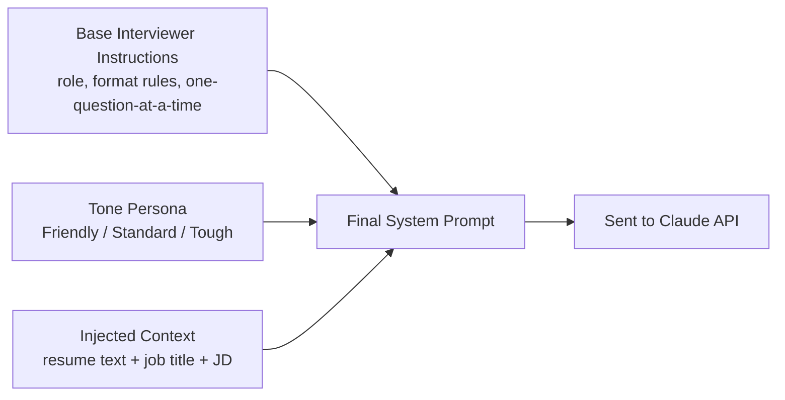

# CrackIt — System Architecture
### Day 2 Deliverable — AI Resume Defense Simulator

> This document defines the complete technical architecture for CrackIt v1.0, built on the tech stack locked in the Implementation Blueprint (Section 0). No accounts, no database — a fully stateless, session-based architecture.

---

## 1. Architecture Overview

CrackIt is a **single-repo, full-stack Next.js application** with no separate backend server and no database. All session data (resume text, job description, tone, interview transcript) lives in the browser's React state for the duration of a single visit. Every meaningful piece of work — parsing a resume, running an interview turn, scoring a session, generating a PDF — happens in a **stateless Next.js API route** that receives everything it needs in the request body and returns a complete result. Nothing is persisted between requests on the server.

This keeps the system simple enough for a solo developer to ship in 9 days, and free enough to run indefinitely on Vercel's free tier.

---

## 2. Component Diagram

```mermaid
graph TB
    subgraph Browser["Browser (Client)"]
        UI[React UI Components]
        SC[SessionContext<br/>resume, JD, tone, transcript]
        UI <--> SC
    end

    subgraph Vercel["Vercel — Next.js App (Single Deployment)"]
        subgraph Pages["Pages (App Router)"]
            P1[/setup/]
            P2[/interview/]
            P3[/results/]
        end

        subgraph API["API Routes (Stateless)"]
            A1[POST /api/parse-resume]
            A2[POST /api/interview/start]
            A3[POST /api/interview/next]
            A4[POST /api/feedback]
            A5[POST /api/generate-report]
        end
    end

    subgraph External["External Services"]
        Claude[Anthropic Claude API]
    end

    UI -->|file upload| A1
    UI -->|start session| A2
    UI -->|submit answer| A3
    UI -->|interview complete| A4
    UI -->|download report| A5

    A2 --> Claude
    A3 --> Claude
    A4 --> Claude

    A1 -.->|pdf-parse / mammoth, no external call| A1
    A5 -.->|@react-pdf/renderer, no external call| A5
```

**Key point:** only three of the five API routes call the Claude API (`start`, `next`, `feedback`). Resume parsing and PDF generation are handled entirely by local libraries — no external dependency, no extra cost, no extra latency.

---

## 3. Data Flow

Data flows in one direction per request: **Client → API Route → (optionally) Claude API → back to Client**. The server never stores anything between calls; the client re-sends the full relevant state (transcript, resume text, etc.) every time.

```mermaid
flowchart LR
    A[User pastes/uploads resume] --> B[SessionContext updated<br/>resumeText, jobTitle, jobDescription]
    B --> C[User selects tone]
    C --> D["/api/interview/start<br/>(resumeText + JD + tone) → Claude"]
    D --> E[First question returned<br/>+ sessionContext with targetQuestionCount]
    E --> F[User answers in chat UI]
    F --> G["/api/interview/next<br/>(full transcript + sessionContext) → Claude"]
    G -->|more questions needed| F
    G -->|cap reached| H["/api/feedback<br/>(full transcript) → Claude"]
    H --> I[Scores + strengths/weaknesses<br/>+ suggestions + model answers]
    I --> J["/api/generate-report<br/>(feedback + transcript) → PDF"]
    J --> K[User downloads PDF]
```



**Why the full transcript is re-sent every turn:** since there is no database and no server-side session, the Claude API call itself is the only "memory" the system has. Each call to `/api/interview/next` includes the entire conversation so far, allowing Claude to generate a contextually appropriate follow-up question without needing any server-side state.

---

## 4. Request Lifecycle (Worked Example: One Interview Turn)

This traces exactly what happens when a candidate submits one answer during the interview:

1. **Client:** User types an answer and clicks "Send." The React component appends `{ role: "candidate", text }` to the local `transcript` array in `SessionContext`.
2. **Client → Server:** A `POST` request is sent to `/api/interview/next` with body:
   ```json
   {
     "transcript": [ /* full array so far */ ],
     "sessionContext": { "tone": "standard", "targetQuestionCount": 8, "questionIndex": 3 }
   }
   ```
3. **Server:** The API route checks `questionIndex >= targetQuestionCount`.
   - If **true**: skip the Claude call entirely, return `{ interviewComplete: true }` immediately (saves an API call and money).
   - If **false**: continue to step 4.
4. **Server → Claude API:** The route builds a system prompt (tone persona + resume + JD) and sends the full transcript as conversation history, instructing Claude to return exactly one new interviewer question.
5. **Claude API → Server:** Returns the next question as plain text.
6. **Server → Client:** Response returned:
   ```json
   { "question": "...", "sessionContext": { "tone": "standard", "targetQuestionCount": 8, "questionIndex": 4 } }
   ```
7. **Client:** Appends `{ role: "interviewer", text: question }` to the transcript, updates `sessionContext`, re-renders the chat with the new question, and increments the visible progress indicator.

Every other endpoint (`start`, `feedback`, `generate-report`) follows the same pattern: client sends everything needed → server does one unit of work → server returns a complete result → server forgets everything.

---

## 5. AI Interaction Design

### 5.1 System Prompt Composition
Every call to Claude (`start`, `next`, `feedback`) is built from **three composable parts**:



This composition lives in `src/lib/prompts.js` (per the Project Structure doc) so tone personas, base rules, and context injection are each edited independently without touching API route logic.

### 5.2 Adaptive Question Count Logic
Handled entirely in `/api/interview/start`, before the first Claude call:

| Signal | Target Question Count |
|---|---|
| No JD provided, resume has ≤2 experience/project entries | 6 |
| No JD provided, resume has 3+ entries | 8 |
| JD provided, resume has ≤2 entries | 9 |
| JD provided, resume has 3+ entries | 10–12 (favor 12 if JD is long/detailed) |

This is a simple rule-based heuristic (counting bullet points / entries in the extracted resume text), **not an extra AI call** — keeping it fast and free. This directly follows the Blueprint's guidance to keep this logic simple rather than over-engineered.

### 5.3 Feedback Generation Contract
`/api/feedback` sends the full transcript plus an explicit instruction to return **only** raw JSON matching the schema defined in `SCHEMA.md`. See `API.md` for the full request/response contract and error handling for malformed JSON.

---

## 6. External Services

| Service | Purpose | Cost |
|---|---|---|
| **Anthropic Claude API** | Powers the interview conversation and feedback scoring | Pay-as-you-go, low cost per session (a few cents), well within the "few dollars total" comfort level approved in the PRD |
| **Vercel** | Hosting + CI/CD (auto-deploy from GitHub) | Free (Hobby tier) |
| **GitHub** | Source control, connects to Vercel | Free (private repo) |

No other external services are used — deliberately, to protect the "free-tier, low-cost" constraint from the PRD.

---

## 7. Why This Architecture Fits the PRD

- **No accounts / no login (FR out-of-scope item):** achieved trivially — there's no user table to create in the first place.
- **Free-tier hosting requirement (NFR — Cost):** one Vercel deployment, no database hosting cost, no auth provider cost.
- **Reliability requirement (NFR):** every API route is independent and stateless — a failure in one request never corrupts a "session" on the server, because there is no server-side session to corrupt.
- **Performance requirement (NFR — 3–8s AI responses):** every Claude call does exactly one unit of work (one question, or one scoring pass) rather than chaining multiple AI calls per user action, keeping latency predictable.
