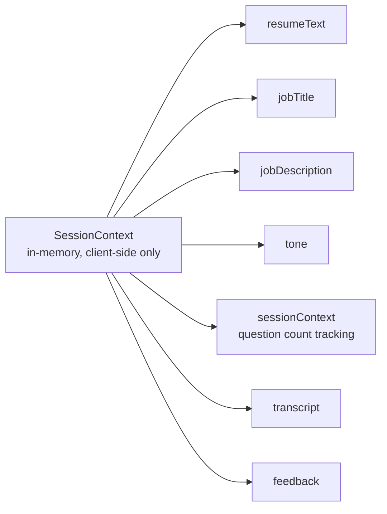

# CrackIt — Data Schema
### Day 2 Deliverable — Session State & Data Contracts (No Database)

> **Why this document isn't a traditional database schema:** the approved PRD (Section 5.2, "Explicitly Out of Scope") and the Implementation Blueprint (Section 0, Locked Architecture) both establish that CrackIt v1.0 has **no accounts, no login, and no persistent storage**. There are no tables, no relationships, and no migrations. Instead, this document defines the **shapes of data that flow through the system** — held in the browser's memory for the duration of one session and passed between API calls. This is the correct architectural translation of "Database Design" for a stateless product.

---

## 1. Where Data Lives

All data below lives in **`SessionContext`** (a React Context on the client) for the duration of one browser session. Nothing is written to disk or a database at any point. When the browser tab closes or refreshes, all data is gone — exactly as intended by the PRD's privacy and no-persistence requirements.



---

## 2. Core Data Shapes

### 2.1 `SessionState` (top-level client state)
```ts
{
  resumeText: string,          // extracted or pasted resume content
  jobTitle: string | null,     // optional
  jobDescription: string | null, // optional
  tone: "friendly" | "standard" | "tough" | null,
  interviewSessionContext: InterviewSessionContext | null,
  transcript: TranscriptEntry[],
  feedback: FeedbackResult | null
}
```

### 2.2 `InterviewSessionContext`
Tracks adaptive progress through the interview — this is the closest thing CrackIt has to a "session record," and it lives entirely client-side, round-tripped through each API call.
```json
{
  "tone": "standard",
  "targetQuestionCount": 8,
  "questionIndex": 3
}
```
| Field | Type | Notes |
|---|---|---|
| `tone` | enum: `friendly` \| `standard` \| `tough` | Set once at interview start, immutable for the session |
| `targetQuestionCount` | integer, 6–12 | Computed once in `/api/interview/start` per the adaptive logic in `ARCHITECTURE.md` |
| `questionIndex` | integer, starts at 1 | Incremented by the server on each `/api/interview/next` call |

### 2.3 `TranscriptEntry`
```json
{ "role": "interviewer", "text": "Tell me about the project listed as 'Inventory System'..." }
```
| Field | Type | Constraints |
|---|---|---|
| `role` | enum: `interviewer` \| `candidate` | Required |
| `text` | string | Required, non-empty for `candidate` entries (validated client-side before submission) |

The `transcript` is an ordered array of these entries, alternating `interviewer` → `candidate` → `interviewer` ...

### 2.4 `FeedbackResult` (locked schema from the Blueprint, restated here as the canonical contract)
```json
{
  "scores": {
    "resumeCredibility": 72,
    "technicalKnowledge": 65,
    "communication": 80,
    "problemSolving": 58,
    "confidence": 70,
    "resumeJdFit": 63
  },
  "strengths": ["Clear articulation of the Inventory System project's architecture"],
  "weaknesses": ["Vague ownership claims on team leadership experience"],
  "suggestions": ["Quantify impact with specific metrics (e.g., users served, latency improved)"],
  "modelAnswers": [
    {
      "question": "You list 'led a team of 4' — what did leading actually involve day-to-day?",
      "candidateAnswer": "I just made sure everyone did their part.",
      "betterAnswer": "I split the project into 3 modules, ran twice-weekly check-ins, and unblocked a teammate stuck on the API integration by pairing for an afternoon."
    }
  ]
}
```
| Field | Type | Constraints |
|---|---|---|
| `scores.*` | integer, 0–100 | All 6 fixed category keys always present |
| `strengths` | string[] | 1 or more entries |
| `weaknesses` | string[] | 1 or more entries |
| `suggestions` | string[] | 1 or more entries, specific and actionable (FR-5.3) |
| `modelAnswers` | array of `{question, candidateAnswer, betterAnswer}` | 2–3 entries (FR-5.4), each referencing a real transcript exchange |

### 2.5 `ParsedResumeResult` (returned by `/api/parse-resume`)
```json
{ "success": true, "text": "John Doe\nSoftware Engineering Intern..." }
```
or, on failure:
```json
{ "success": false, "reason": "Could not extract readable text from this file." }
```

---

## 3. Schema Validation Against PRD User Stories / Functional Requirements

| PRD Requirement | Covered By | How |
|---|---|---|
| FR-1.1 Paste resume text | `SessionState.resumeText` | Directly settable from the paste textarea |
| FR-1.2 Upload PDF/DOCX | `ParsedResumeResult` | Returned by `/api/parse-resume`, then written into `resumeText` |
| FR-1.3 Automatic extraction | `ParsedResumeResult.text` | Extracted server-side via `pdf-parse`/`mammoth` |
| FR-1.4 Fallback to paste on failure | `ParsedResumeResult.success = false` | Client checks this flag and shows the paste prompt |
| FR-2.1 / FR-2.2 Optional job title/JD | `SessionState.jobTitle`, `jobDescription` | Both nullable, no validation blocks continuation |
| FR-2.3 / FR-2.4 JD-aware vs generic interview | `InterviewSessionContext` + prompt composition | `jobDescription` presence changes both the system prompt and `targetQuestionCount` |
| FR-3.1 / FR-3.2 Tone selection | `InterviewSessionContext.tone` | Enum locked to 3 values, drives persona prompt selection |
| FR-4.1–FR-4.5 Adaptive multi-turn interview | `TranscriptEntry[]` + `InterviewSessionContext` | Transcript grows each turn; `questionIndex` vs `targetQuestionCount` drives adaptivity and progress display |
| FR-5.1–FR-5.4 Structured feedback | `FeedbackResult` | Exact schema above, all sub-fields mapped to specific FRs |
| FR-6.1–FR-6.3 PDF report, no login | `FeedbackResult` + `TranscriptEntry[]` → `/api/generate-report` | Report generation only needs data already in `SessionState`; no account/database lookup involved |

Every functional requirement in the PRD has a corresponding field or flow in this schema — no user story is unsupported, and no field exists without a corresponding requirement (avoiding schema bloat / scope creep).

---

## 4. Explicit Non-Goals (v2 Deferred)

The following would require a real database and are **intentionally excluded** from this schema, per the PRD's Future Scope section:
- `User` table (accounts, auth)
- `InterviewHistory` table (saved past sessions)
- `SharedReportLink` table (shareable web links)

If v2 introduces accounts, this document will need a genuine relational schema (e.g., `users`, `interview_sessions`, `reports` tables) — noted here so future-you isn't surprised.
