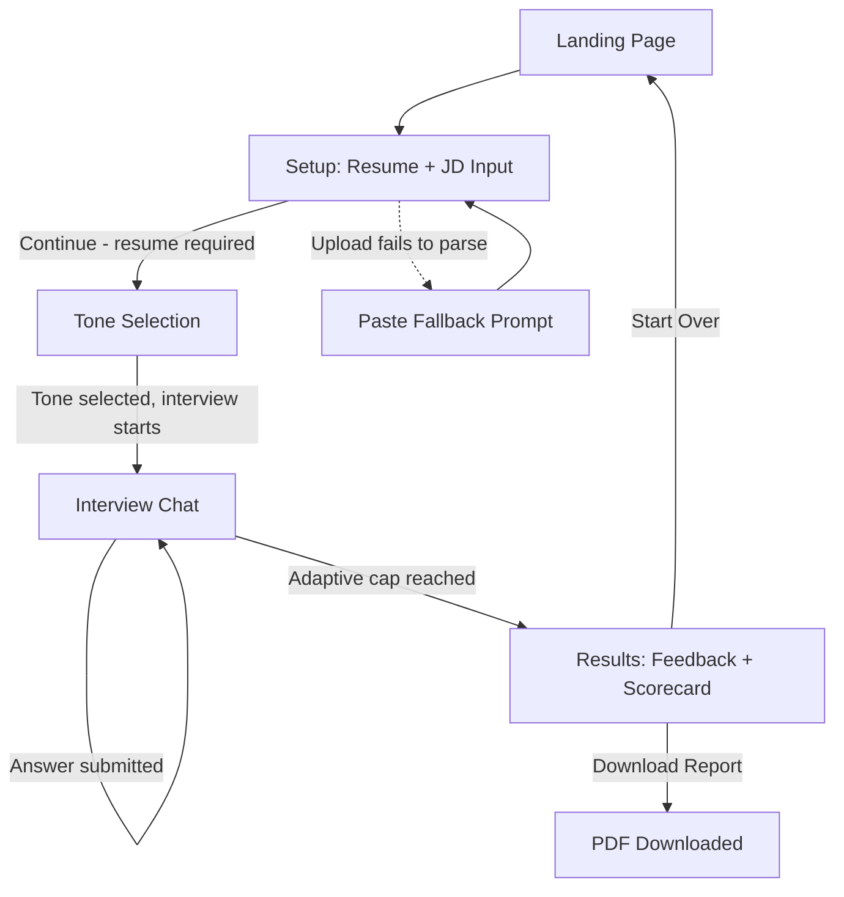

# CrackIt — UI & User Flow
### Day 2 Deliverable — Complete User Journey, Screens & Wireframes

---

## 1. User Flow Diagram



Every screen has exactly one primary forward action, and the only backward path is "Start Over" from Results — this keeps the journey linear and demo-friendly, with no dead ends (per the PRD's usability requirement).

---

## 2. Screen Flow (5 Screens — each exists for a specific reason)

| # | Screen | Route | Reason it exists |
|---|---|---|---|
| 1 | **Landing** | `/` | First impression + single clear CTA to start; sets expectations before any input is required |
| 2 | **Setup** | `/setup` | Collects the two required inputs (resume) and two optional inputs (job title/JD) — the raw material the whole product depends on |
| 3 | **Tone Selection** | part of `/interview` (initial state) | A deliberate, low-friction personalization moment before the "real" interview begins |
| 4 | **Interview Chat** | `/interview` (active state) | The core product experience — the adaptive, multi-turn conversation |
| 5 | **Results** | `/results` | The payoff — where all the earlier effort converts into visible value (scores, feedback, downloadable report) |

No screen is decorative; each maps directly to a distinct step in the PRD's High-Level User Flow (Section 8).

---

## 3. Low-Fidelity Wireframes

### 3.1 Landing Page (`/`)
```
┌──────────────────────────────────────────────────┐
│  CrackIt                                          │
│                                                    │
│        Defend your resume before they do.        │
│                                                    │
│   Practice a realistic mock interview built       │
│   from your actual resume and target job.         │
│                                                    │
│              [  Start Interview  ]                │
│                                                    │
│   ✓ No sign-up required   ✓ Free to use           │
└──────────────────────────────────────────────────┘
```

### 3.2 Setup — Resume & Job Input (`/setup`)
```
┌──────────────────────────────────────────────────┐
│  Step 1 of 3 — Tell us about you                  │
│                                                    │
│  [ Paste Resume ]  [ Upload File ]  ← toggle       │
│  ┌──────────────────────────────────────────┐     │
│  │ (textarea for pasted resume text,        │     │
│  │  or drag-and-drop file zone)             │     │
│  └──────────────────────────────────────────┘     │
│  ⚠ Couldn't read that file — paste text below     │  ← conditional
│                                                    │
│  Target Job Title (optional)                      │
│  ┌──────────────────────────────────────────┐     │
│  └──────────────────────────────────────────┘     │
│                                                    │
│  Job Description (optional)                       │
│  ┌──────────────────────────────────────────┐     │
│  │                                          │     │
│  └──────────────────────────────────────────┘     │
│                                                    │
│                          [ Continue → ]           │  ← disabled until resume present
└──────────────────────────────────────────────────┘
```

### 3.3 Tone Selection (start of `/interview`)
```
┌──────────────────────────────────────────────────┐
│  Step 2 of 3 — Choose your interviewer            │
│                                                    │
│  ┌───────────┐  ┌───────────┐  ┌───────────┐      │
│  │ Friendly  │  │ Standard  │  │  Tough    │      │
│  │ Supportive│  │Professional│ │ Skeptical │      │
│  │ coach     │  │ realistic │  │  panel    │      │
│  └───────────┘  └───────────┘  └───────────┘      │
│    (click a card to select and begin)             │
└──────────────────────────────────────────────────┘
```

### 3.4 Interview Chat (active `/interview`)
```
┌──────────────────────────────────────────────────┐
│  Question 4 of ~8            [progress bar ████░░]│
│                                                    │
│  🤖 You mention leading a team of 4 —              │
│     what did that involve day-to-day?             │
│                                                    │
│                        I mostly assigned tasks 🧑  │
│                                                    │
│  🤖 Interviewer is thinking...                     │
│                                                    │
│  ┌──────────────────────────────────────────┐     │
│  │ Type your answer...                      │     │
│  └──────────────────────────────────────────┘     │
│                                    [ Send → ]     │
└──────────────────────────────────────────────────┘
```

### 3.5 Results — Feedback & Report (`/results`)
```
┌──────────────────────────────────────────────────┐
│  Your Interview Report                            │
│                                                    │
│  Resume Credibility     ████████░░  72             │
│  Technical Knowledge    ██████░░░░  65             │
│  Communication          █████████░  80             │
│  Problem Solving        █████░░░░░  58             │
│  Confidence             ███████░░░  70             │
│  Resume-JD Fit          ██████░░░░  63             │
│                                                    │
│  Strengths                 Weaknesses              │
│  • Clear project detail    • Vague leadership claim│
│                                                    │
│  Suggestions                                      │
│  • Quantify impact with specific metrics          │
│                                                    │
│  Model Answer                                     │
│  Q: What did leading involve day-to-day?          │
│  You said: "I just made sure everyone did..."     │
│  Try instead: "I split the project into 3..."     │
│                                                    │
│         [ Download PDF Report ]  [ Start Over ]   │
└──────────────────────────────────────────────────┘
```

---

## 4. Navigation Rules

- **Forward-only by default.** There is no "Back" button between Setup → Tone → Interview → Results, since re-entering an in-progress interview would break the transcript's integrity. If the user needs to change their resume, "Start Over" from Results (or the browser back button, accepted as an edge case) is the supported path.
- **The "Continue" button on Setup is disabled** until `resumeText` is non-empty — prevents an empty-state interview from ever starting (ties to FR validation in `API.md`).
- **Tone Selection has no explicit "Continue" button** — selecting a card immediately triggers `/api/interview/start` and transitions into the chat, reducing friction at the one point in the flow where hesitation is most likely.
- **The Results screen is a dead end by design** — "Download PDF" and "Start Over" are the only two actions, reinforcing that the session is complete and nothing more will be saved (consistent with the no-persistence architecture).

---

## 5. Visual Identity (carried from Day 1 Pitch Deck, applied consistently)

| Element | Choice |
|---|---|
| Primary color | Navy (`#1E2761`) |
| Accent color | Gold (`#C9A227`) |
| Background/secondary | Ice-blue/off-white (`#F4F6FB`) |
| Headings font | Serif (Cambria or similar) — matches PRD/Pitch Deck title styling |
| Body font | Tailwind's default sans-serif stack |

This ensures the deployed app visually matches the Pitch Deck and PRD, presenting one consistent brand across every artifact judges/recruiters will see.
